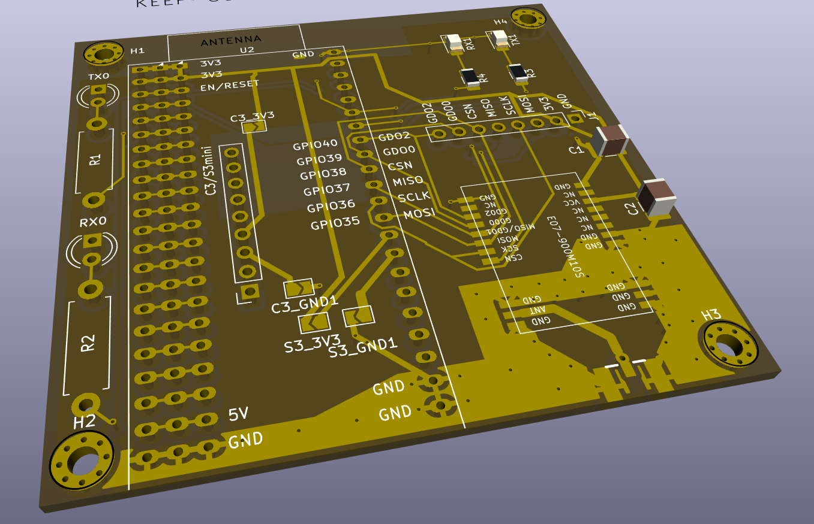
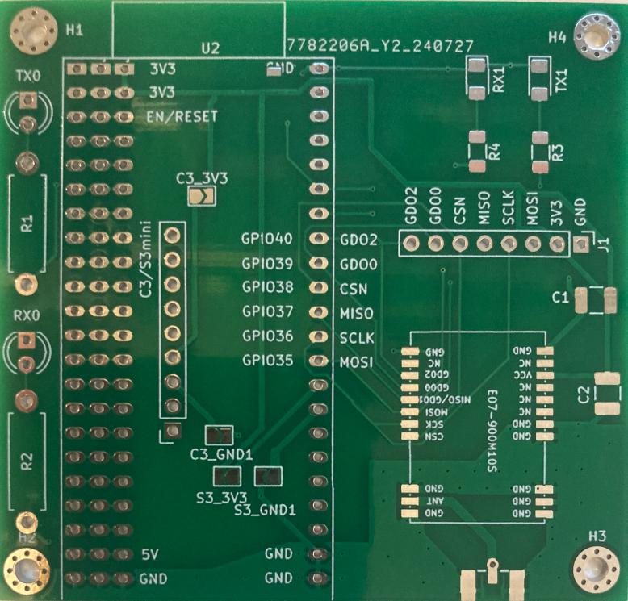
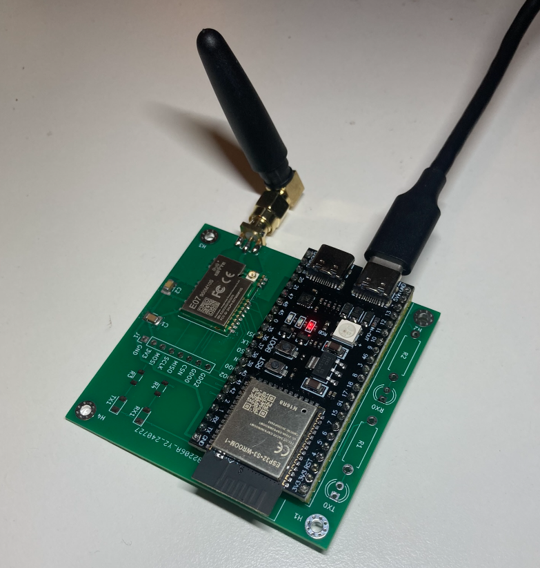
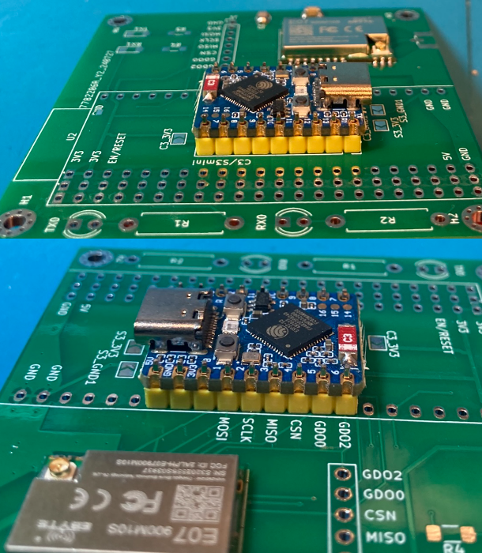
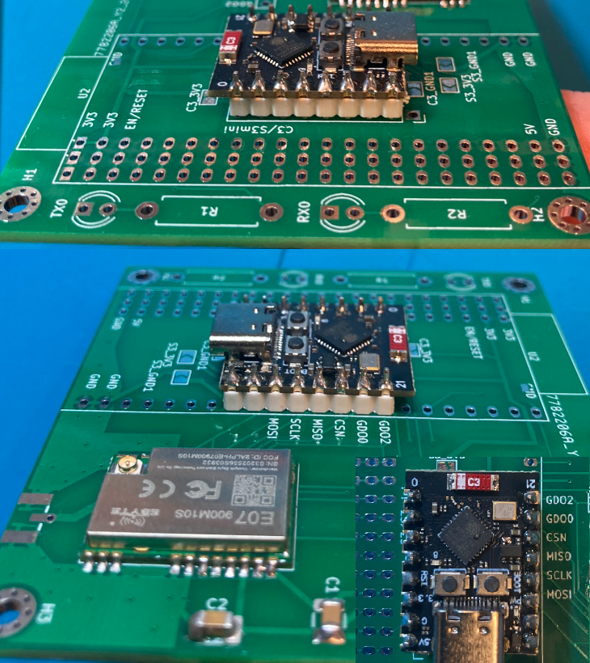

# e07-900m10s-esp32s3 adapter board for ESP32 S3 DevKit and mini boards
Adapter board for [ebyte e07-900m10s CC1101 module](https://www.ebyte.com/en/product-view-news.html?id=1567)

3d view:

This should run [Ramses_ESP](https://github.com/IndaloTech/ramses_esp/) out of the box on:

ESP32 S3 DevKit-C module (9 units wide)
(TODO link and pic)

[ESP32 S3 DevKit-C module](https://nl.aliexpress.com/item/1005006387668474.html) (10 units wide)

 - [E07 900M10S](https://www.ebyte.com/en/product-view-news.html?id=1567) cc1101 module.
 - C1 and C2 are 1206 SMD size
 - C1 = 100nF
 - C2 = 10uF
 - C2 is probably not needed, it is used as a buffer for large currents while sending.
 - LED TX blue SMD 1206
 - LED RX green SMD 1206
 - THT LEDs as backup.
 - Suitable value for R1-R4 is 22O ohm
 - Antenna connector is [PCB SMA female](https://nl.aliexpress.com/item/1005005708712726.html) (use standard 1.6mm board thickness)
 - Antenna is a male SMA 3dBi 868/915Mhz 5cm antenna. This [TX-915-XPL-100 antenna](https://nl.aliexpress.com/item/1005004843392517.html) works great.
 - The IPEX stamp antenna on the module should also be useable (not tested)
 - The header is a standard .1" (2.54mm) PCB header. It is not needed, just for testing.

This repo contains the KiCad 8 files as well as the gerbers to produce the PCB.
I used JLCPCB for my board. Just upload the zip-file in the gerber folder to JLPCB.

## Known issues (improvements)
 - Messed up the ESP32C3 supermini pinout. Jumper/botch wires necessary.
 - Mounting holes not 100% square
 - Mounting hole H1 is in ESP32S3 Antenna keep out zone
 - Pin markings on back of PCB (for soldering) would be nice
 - GND fill on entire top layer

## Prototype:

This is a clone of the (excellent!) [Ramses_ESP](https://github.com/IndaloTech/ramses_esp/) Ramses-II RF bridge. (evofw3 HGI-80 clone).
Using the esp32-s3 it clones the behaviour of the HGI-80: RF tot USB serial and adds MQTT over WiFi.

## Other ESP32 boards
Waveshare ESP32 s3 mini 

Mount the ESP32 s3 mini as shown.
Close S3_3V3 and S3_GND solder bridges.

ESP32 c3 mini board.

Mount the ESP32 C3 mini board with pin 21 at "GDO2" (pin40 on esp32s3 devkit C).
On the side of the USB connector one hole on the PCB is not used.
Close the C3_3V3 and C3_GND solderbridges.

## Where can I order?
Buy the original ramses ESP from [IndaloTech](https://indalo-tech.onlineweb.shop/). This product is not affialiated at all with IndaloTech. It's just a clone. However, I've previously bought a SSM-D2 (ramses_esp predecessor) and its build quality is excellent.

You can order the PCB from your favorite PCB fabshop using the gerbers in the gerber folder. I used JLCPCB.

I might sell some stuff on [Tweakers V&A](https://tweakers.net/aanbod/user/90636/) (NL only)
